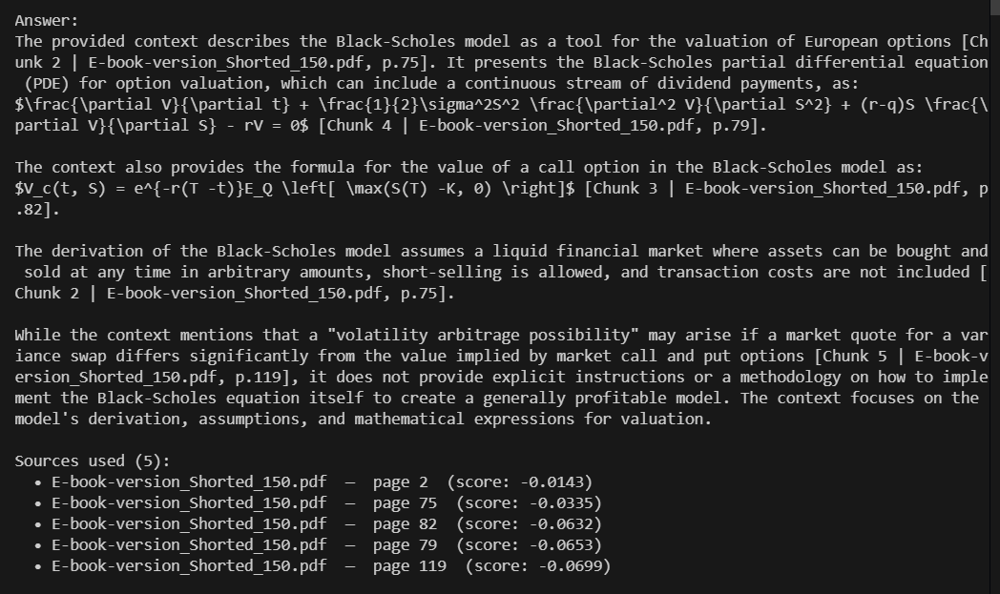

# Math & Quant AI



RAG-powered AI assistant for quantitative finance and mathematics.
Supports four LLM providers — free local inference via Ollama out of the box.

---

## LLM Providers

| Provider | Use case | Cost | Setup |
|---|---|---|---|
| **Ollama** (default) | Local development | Free | Install Ollama + pull a model |
| **Gemini** | Production (fast + cheap) | Free tier available | Add `GEMINI_API_KEY` |

Switch providers by changing `LLM_PROVIDER` in your `.env` — no code changes needed.

---

## Quickstart

### Option A — Local (Ollama, free)

```bash
# 1. Install Ollama: https://ollama.com
ollama pull llama3.2:1b

# 2. Install dependencies
pip install -r requirements.txt

# 3. Configure
cp .env.example .env
# LLM_PROVIDER=ollama is already the default

# 4. Ingest a PDF
python scripts/ingest_pdf.py data/raw/your_textbook.pdf

# 5. Query
python scripts/query.py "Derive the Black-Scholes equation"

# 6. Start API server
python run.py
```

### Option B — Cloud (Gemini)

```bash
cp .env.example .env
# Set: LLM_PROVIDER=gemini
# Set: GEMINI_API_KEY=your_key   (free at https://aistudio.google.com/apikey)
python run.py
```

---

## API Endpoints

| Method | Path | Auth | Description |
|---|---|---|---|
| GET | `/health` | None | Health check |
| POST | `/query` | X-API-Key | Ask a question |
| POST | `/ingest` | X-API-Key | Ingest a PDF |

### Example — Query

```bash
curl -X POST http://localhost:8000/query \
  -H "Content-Type: application/json" \
  -H "X-API-Key: your_secret" \
  -d '{"query": "Explain the Sharpe Ratio", "top_k": 5}'
```

### Example — Ingest

```bash
curl -X POST http://localhost:8000/ingest \
  -H "Content-Type: application/json" \
  -H "X-API-Key: your_secret" \
  -d '{"pdf_path": "data/raw/finance_textbook.pdf"}'
```

---

## Smart Chunking

Short PDF pages (≤ `CHUNK_SIZE × SHORT_PAGE_FACTOR` characters) are kept whole
rather than split. This preserves proofs, derivations, and theorem statements
that would lose meaning if cut mid-way.

---

## Project Structure

```
math-quant-ai/
├── ingestion/
│   ├── pdf_parser.py     # PyMuPDF + pdfplumber fallback
│   ├── chunker.py        # Smart chunking (short pages kept whole)
│   └── embedder.py       # sentence-transformers → ChromaDB
├── rag/
│   ├── retriever.py      # Top-k similarity search
│   ├── llm_client.py     # Ollama | Gemini | Anthropic | OpenAI
│   └── pipeline.py       # retrieve → format → generate
├── api/
│   └── main.py           # FastAPI: /health /query /ingest
├── config/
│   └── settings.py       # Pydantic settings (all from .env)
├── scripts/
│   ├── ingest_pdf.py     # CLI: ingest one PDF
│   ├── query.py          # CLI: query the knowledge base
│   └── schema.sql        # MySQL metadata schema
├── tests/
│   ├── test_ingestion.py
│   └── test_pipeline.py
├── data/
│   ├── raw/              # Drop PDFs here
│   ├── processed/
│   └── chroma/           # ChromaDB (auto-created)
├── .env.example
├── requirements.txt
└── run.py
```

---

## Roadmap

- [x] Ollama (local Llama) support
- [x] Gemini support
- [x] Smart chunking for math PDFs
- [x] Numbered chunk citations
- [ ] MySQL query logging
- [ ] Batch folder ingestion
- [ ] Streaming responses (`/query/stream`)
- [ ] Fundamental Research AI agent
- [ ] Multi-agent coordinator
